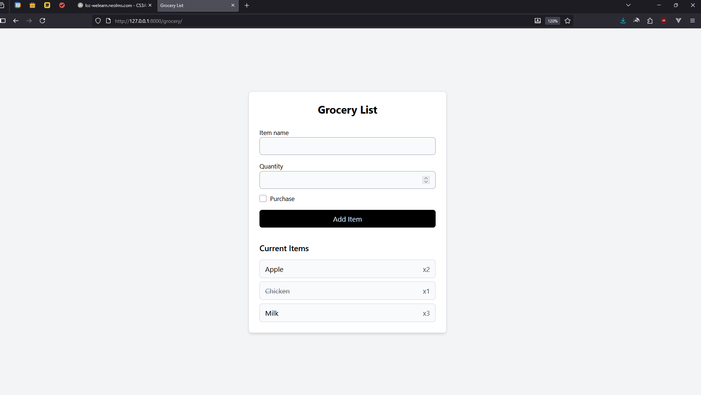

# Grocery List

A simple **Grocery Listing System** built with Django as a requirement for **Application Development Activity 1 (05/09/2025)**.

## Features

- Add, update, and delete grocery items
- Organize and track your grocery list
- Simple, clean interface using Django

### Home Page


### Grocery List View



## Tech Stack

- **Backend:** Django (Python)
- **Frontend:** HTML, CSS (Tailwind optional)
- **Database:** SQLite (default)

## Setup

1. Clone the repository
   ```bash
   git clone https://github.com/yourusername/grocery-list.git
   cd grocery-list
   ```
